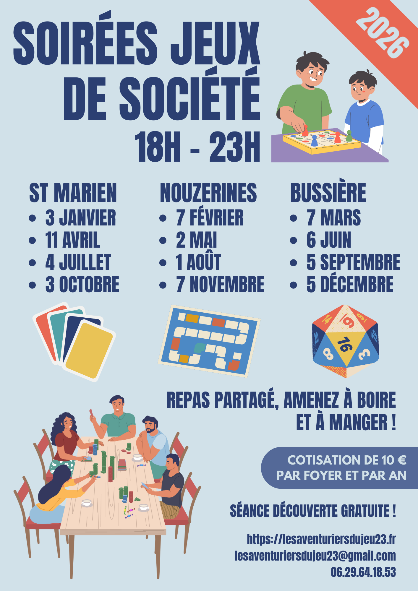

Bienvenue chez les aventuriers du jeu !

Nous organisons des soirées jeux une fois par mois, (normalement) le premier samedi du mois, en roulement sur les communes de Nouzerines, Bussière-Saint-Georges et Saint Marien.
Ça se passe de 18h à 23h, et c'est ouvert pour tout public !

L'association apporte des jeux, et vous pouvez ramener les vôtres également. Chacun rapporte à boire et à manger, et on se partage tout ça, dans la joie et la bonne humeur !

## Prochaines séances

Horaires : 18H à 23H

- 3 janvier : Saint Marien
- 7 février : Nouzerines
- 7 mars : Bussière-Saint-Georges
- 11 avril : Saint Marien
- 2 mai : Nouzerines
- 6 juin : Bussière-Saint-Georges
- 4 juillet : Saint Marien
- 1 août : Nouzerines
- 5 septembre : Bussière-Saint-Georges
- 3 octobre : Saint Marien
- 7 novembre : Nouzerines
- 5 décembre : Bussière-Saint-Georges

## Ludothèque

Les jeux disponibles de l’association sont ici :


  

